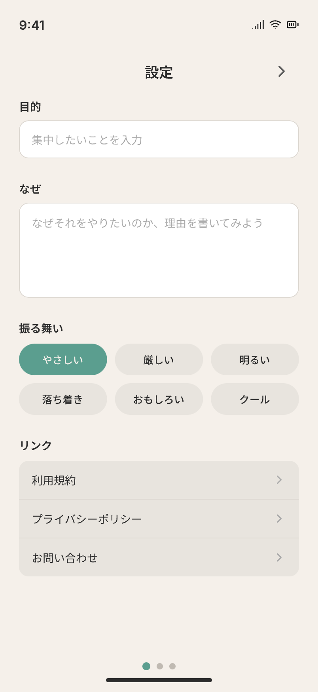
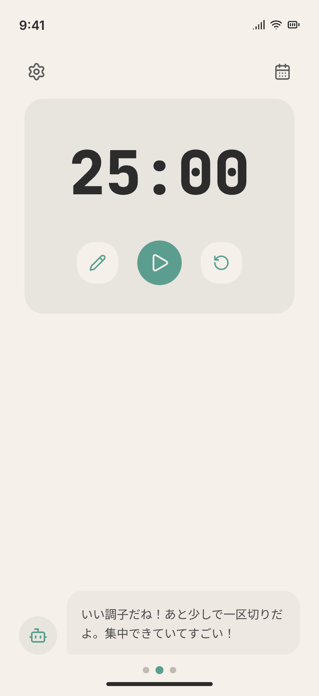
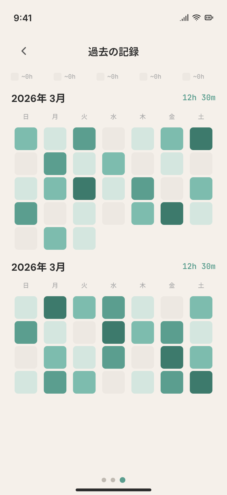

<p align="center">
  
</p>

<h1 align="center">Focory</h1>

<p align="center">
  <strong>スマホを触らず、勉強に集中する。</strong><br />
  離脱を見張る AI が、あなた専用の言葉で声をかけてくれる学習アプリ。
</p>

<p align="center">
  <em>🚧 現在開発中のプロジェクトです。</em>
</p>

---

## Focory とは

**Focory（フォコリー）** は、勉強中にスマホを触ってしまうユーザーに対して、AI がパーソナライズされたメッセージで声をかける学習支援アプリです。

タイマーをスタートしたあとにスマホを触ったり、アプリから離脱したりすると、AI があなたの「目的」「理由」「好みの口調」に合わせた通知を送り、集中状態へ引き戻します。

### コンセプトの背景

前身プロジェクト **SWiT Study** では「フレンドと勉強時間を共有する」というアイデアを試しましたが、想定よりユーザーに響きませんでした。
そこで Focory では方針を転換し、**人ではなく "AI による監視" を軸にしたひとり集中体験**を提供しています。

- フレンドを探す必要がない
- 他人の目がなくてもサボれない
- AI が「今のあなた」に合った言葉で伴走してくれる

---

## スクリーンショット

<p align="center">
  
  
  
</p>

<p align="center">
  <sub>左から: 設定 / 集中タイマー / 過去の記録</sub>
</p>

---

## 主な機能

### ⏱ 集中タイマー
ポモドーロ形式のシンプルなタイマー。開始後にスマホを触ると AI が介入します。画面下部には、あなたの設定に応じたリアルタイムのメッセージが表示されます。

### 🤖 AI によるパーソナライズ監視
ユーザーがアプリから離脱した瞬間を検知し、通知で声がけ。
メッセージは「なぜそれをやりたいのか」という目的と、選択した**AI の振る舞い**に基づいて生成されます。

選べる振る舞い:
- `やさしい` / `厳しい` / `明るい` / `落ち着き` / `おもしろい` / `クール`

### 📅 学習ログ（ヒートマップ）
日々の集中時間をカレンダー形式のヒートマップで可視化。色の濃さで学習量が一目でわかり、継続のモチベーションになります。

### ⚙️ 設定
- **目的**: 何に集中したいかを入力
- **なぜ**: その理由を書き出すことで、AI があなたに合った声がけをできるようにする
- **振る舞い**: AI の性格・口調の選択

---

## 使用技術

### モバイル（[apps/mobile](apps/mobile/)）
- **React Native** + **Expo (SDK 54)** / **Expo Router**
- **NativeWind** (Tailwind CSS for React Native)
- **TanStack Query** + **openapi-react-query**
- **Better Auth (Expo)** による認証
- **Drizzle ORM** + **expo-sqlite**（ローカル DB）
- **Expo Notifications**（離脱時のプッシュ通知）

### バックエンド（[apps/api](apps/api/)）
- **Hono** + **hono-openapi**
- **Cloudflare Workers** (`wrangler`)
- **Drizzle ORM** + **Postgres**
- **Better Auth** + **@better-auth/drizzle-adapter**
- **Upstash Redis**（レート制限・キャッシュ）
- **Zod** によるスキーマバリデーション

### 共通基盤
- **TypeScript** / **pnpm workspaces**
- **Biome / Ultracite** による Lint & Format
- **OpenAPI** 経由でモバイル ⇄ API の型共有

---

## プロジェクト構成

```
focory/
├── apps/
│   ├── mobile/     # React Native + Expo アプリ
│   └── api/        # Hono + Cloudflare Workers API
├── assets/         # ロゴ・スクリーンショット
├── design/         # .pen デザインファイル
├── openapi.json    # API スキーマ（自動生成）
└── package.json    # pnpm workspace ルート
```

---

## セットアップ

### 必要要件
- Node.js (推奨: LTS)
- pnpm `10.26.2` 以上
- iOS/Android 実機または Simulator（モバイル開発時）
- Cloudflare アカウント（API デプロイ時）

### インストール

```bash
pnpm install
```

### 開発サーバー起動

全ワークスペースを並列で起動:

```bash
pnpm dev
```

個別に起動する場合:

```bash
# モバイル
pnpm -F mobile dev

# API
pnpm -F api dev
```

### コード品質

```bash
# チェック
pnpm check

# 自動修正
pnpm fix
```

### DB マイグレーション（API）

```bash
pnpm db:generate   # マイグレーションファイル生成
pnpm db:migrate    # マイグレーション実行
pnpm db:studio     # Drizzle Studio 起動
```

### OpenAPI 型生成

```bash
pnpm gen-openapi                       # openapi.json を生成
pnpm -F mobile api-typegen             # モバイルの型定義を更新
```
